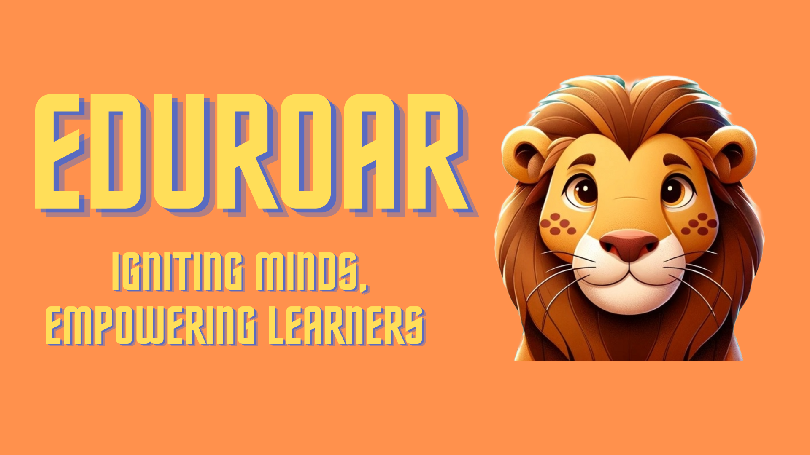

# EduRoar

## About

Eduroar is not just another educational platform; it's a dynamic and innovative tool designed to empower learners of all ages by harnessing the power of artificial intelligence. Say goodbye to mundane quiz creation and hello to a personalized, engaging learning experience tailored just for you.

Dynamically Generate Quiz and Tests suited to your needs on EduRoar with the Power of Gemini-Pro Model.Enhance your knowledge in Any Field with the use of AI

## Inspiration Behind EduRoar

The spark that ignited Eduroar was born out of a profound belief in the transformative potential of education. In a world inundated with information, we recognized the need for a revolutionary approach to learning—one that would break free from conventional constraints and truly empower learners of all ages. The inspiration behind Eduroar stems from the desire to make education not only accessible but also exciting and personalized.

### Unleashing the Power of Artificial Intelligence:
The driving force behind Eduroar is the realization that artificial intelligence can play a pivotal role in reshaping the educational landscape. The Gemini-Pro Model, at the heart of Eduroar, is a testament to our commitment to harnessing the incredible capabilities of AI. By dynamically generating quizzes and tests, we aim to provide learners with a tailored, adaptive, and engaging learning experience.

### A Farewell to Mundane Learning:
The mundane process of quiz creation and standardized testing often hampers the joy of learning. Eduroar bids farewell to the ordinary, introducing a dynamic tool that adapts to your unique learning needs. No longer confined by one-size-fits-all approaches, Eduroar brings forth a new era where each learner can embark on a personalized educational journey.

### Empowering Lifelong Learning:
Eduroar aspires to be more than just an educational platform; it is a catalyst for lifelong learning. Our vision is to inspire a love for knowledge that transcends traditional boundaries, making learning a continuous and enriching adventure. By leveraging AI, Eduroar opens doors to a world of possibilities, encouraging learners to explore, discover, and enhance their knowledge in any field.

### The Future of Education, Today:
In the ever-evolving landscape of education, Eduroar stands as a beacon of innovation. The project is a testament to our commitment to shaping the future of learning, making it not only accessible but also tailored to the needs of each individual. Eduroar is not just a tool; it's an inspiration to reimagine education, embrace the power of technology, and empower minds to reach new heights.

