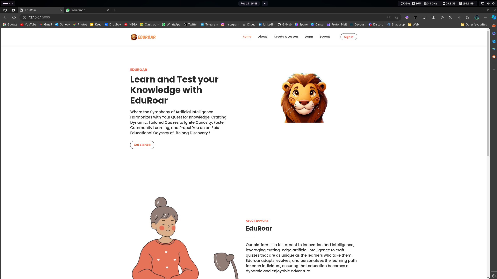
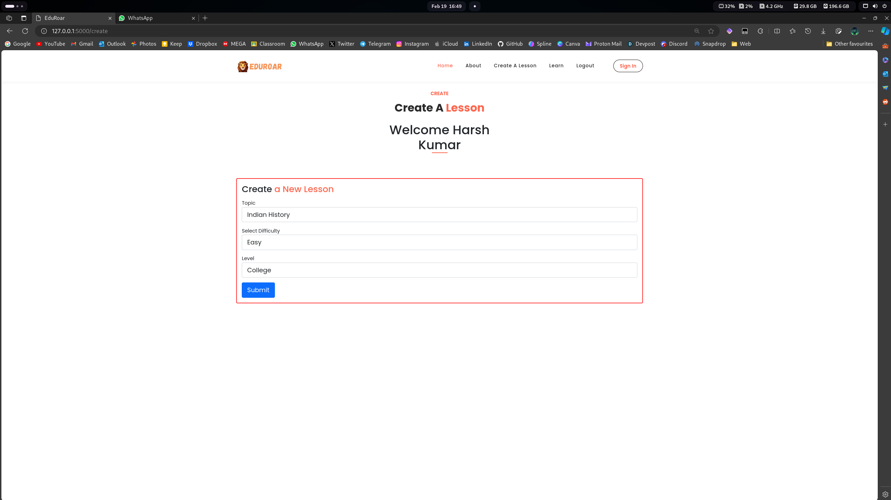
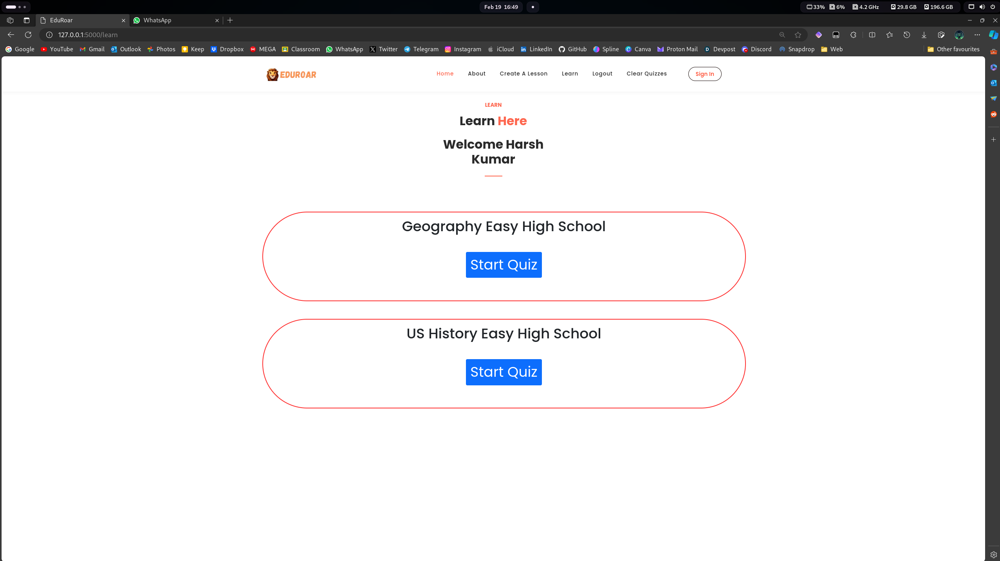
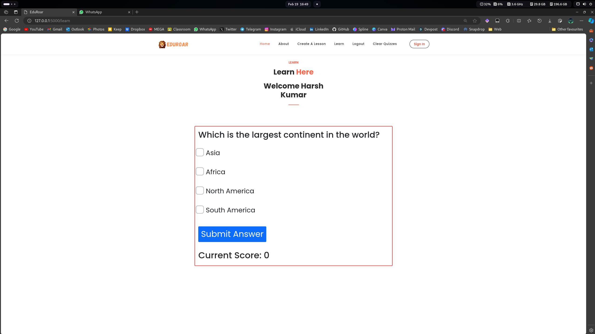
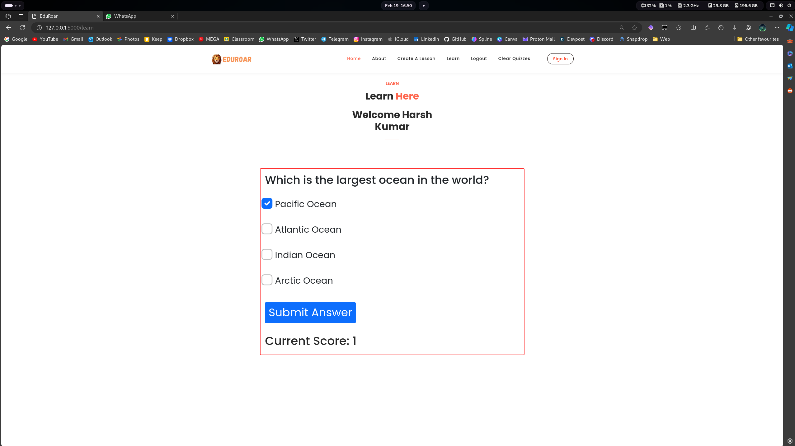
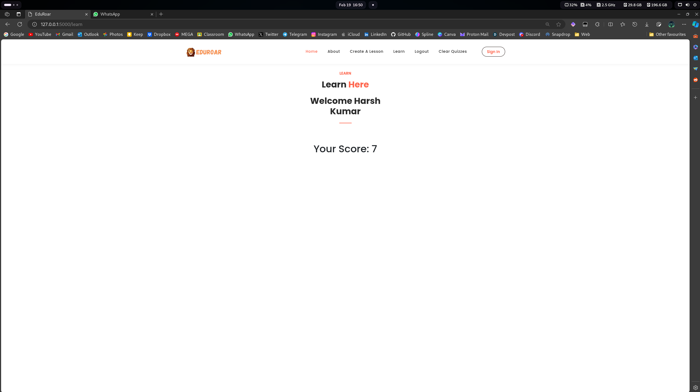

# EduRoar


## About

Eduroar is not just another educational platform; it's a dynamic and innovative tool designed to empower learners of all ages by harnessing the power of artificial intelligence. Say goodbye to mundane quiz creation and hello to a personalized, engaging learning experience tailored just for you.

Dynamically Generate Quiz and Tests suited to your needs on EduRoar with the Power of Gemini-Pro Model.Enhance your knowledge in Any Field with the use of AI

## Inspiration Behind EduRoar

The spark that ignited Eduroar was born out of a profound belief in the transformative potential of education. In a world inundated with information, we recognized the need for a revolutionary approach to learning—one that would break free from conventional constraints and truly empower learners of all ages. The inspiration behind Eduroar stems from the desire to make education not only accessible but also exciting and personalized.

### Unleashing the Power of Artificial Intelligence:
The driving force behind Eduroar is the realization that artificial intelligence can play a pivotal role in reshaping the educational landscape. The Gemini-Pro Model, at the heart of Eduroar, is a testament to our commitment to harnessing the incredible capabilities of AI. By dynamically generating quizzes and tests, we aim to provide learners with a tailored, adaptive, and engaging learning experience.

### A Farewell to Mundane Learning:
The mundane process of quiz creation and standardized testing often hampers the joy of learning. Eduroar bids farewell to the ordinary, introducing a dynamic tool that adapts to your unique learning needs. No longer confined by one-size-fits-all approaches, Eduroar brings forth a new era where each learner can embark on a personalized educational journey.

### Empowering Lifelong Learning:
Eduroar aspires to be more than just an educational platform; it is a catalyst for lifelong learning. Our vision is to inspire a love for knowledge that transcends traditional boundaries, making learning a continuous and enriching adventure. By leveraging AI, Eduroar opens doors to a world of possibilities, encouraging learners to explore, discover, and enhance their knowledge in any field.

### The Future of Education, Today:
In the ever-evolving landscape of education, Eduroar stands as a beacon of innovation. The project is a testament to our commitment to shaping the future of learning, making it not only accessible but also tailored to the needs of each individual. Eduroar is not just a tool; it's an inspiration to reimagine education, embrace the power of technology, and empower minds to reach new heights.

## How we built it ?
Embarking on the creation of Eduroar was a visionary endeavor that seamlessly blended cutting-edge technologies to redefine the educational landscape. The following narrative delves into the meticulous process of crafting this dynamic platform, incorporating Google's Generative AI Gemini, Flask for the backend, Bootstrap for the frontend, and Firebase for database management and user authentication.

### 1.Conceptualization:
The journey began with a clear vision: to revolutionize education through personalized, AI-generated quizzes. This involved defining the core features, user experience, and the integration of advanced technologies to achieve the desired outcome.

### 2. AI Integration with Gemini:
Leveraging the power of Google's Generative AI, Gemini, was a pivotal step. This state-of-the-art model was employed to dynamically generate questions and answers, ensuring a rich and diverse quiz experience for users. Fine-tuning the model for educational content became a key focus during this phase.

### 3.  Flask for Robust Backend:
Flask, a lightweight and flexible Python web framework, was chosen to construct the robust backend infrastructure of Eduroar. This involved designing API endpoints for quiz generation, user authentication, and database interactions. Flask's simplicity and scalability proved instrumental in handling diverse backend functionalities seamlessly.

### 4. Responsive Frontend with Bootstrap:
Bootstrap, the widely acclaimed CSS framework, played a pivotal role in shaping Eduroar's frontend. Implementing a responsive design ensured a seamless user experience across various devices. The integration of Bootstrap components facilitated the creation of an intuitive and visually appealing interface for learners.

### 5. Database Management with Firebase:
Firebase, a cloud-based platform, was selected for its efficiency in real-time database management and user authentication. Eduroar's dynamic quiz data, user profiles, and authentication details are securely stored and retrieved from Firebase, ensuring a reliable and scalable database solution.

### 6. User Authentication:
Firebase Authentication was seamlessly integrated to manage user sign-ups, logins, and secure authentication processes. This feature ensures that each user's data is protected, and personalized learning experiences are securely associated with individual profiles.

### 7.  Iterative Development and Testing:
Eduroar underwent rigorous iterative development and testing phases. Continuous feedback loops were established to refine the AI model, enhance user interfaces, and optimize backend functionalities. Thorough testing ensured a seamless and bug-free user experience.

### 8. Ongoing Optimization:
The development process is ongoing, with a commitment to continuous improvement. User feedback, analytics, and emerging technologies are being actively monitored to implement updates and optimizations, ensuring that Eduroar remains at the forefront of educational innovation.

## Installation and Setup

**Prerequisites**
- Python 3.8 or Higher
- Google Cloud Account 
- Firebase Account

**Install Required Libraries**
```
pip install -r requirements.txt
```

**API KEYS**

This project is built using Firebase and Google Cloud so please place the required API_Keys in Specified Location wherever specified in the Code.Please Enable the Google Cloud Generative AI API.


**Usage**

To run the application, use the following command:
```
flask run
```


## Project Structure

- [app.py](app.py)
- [generate.py](generate.py)
- [README.md](README.md)
- [requirements.txt](requirements.txt)
- screenshots/
- static/
    - assets/
        - css/
            - [animated.css](static/assets/css/animated.css)
            - [fontawesome.css](static/assets/css/fontawesome.css)
            - [main.css](static/assets/css/main.css)
            - [owl.carousel.min.css](static/assets/css/owl.carousel.min.css)
            - [owl.css](static/assets/css/owl.css)
            - [style.css](static/assets/css/style.css)
            - [style2.css](static/assets/css/style2.css)
        - fonts/
            - [Flaticon.woff](static/assets/fonts/Flaticon.woff)
            - [flexslider-icon.eot](static/assets/fonts/flexslider-icon.eot)
            - [flexslider-icon.ttf](static/assets/fonts/flexslider-icon.ttf)
            - [flexslider-icon.woff](static/assets/fonts/flexslider-icon.woff)
            - [fontawesome-webfont.eot](static/assets/fonts/fontawesome-webfont.eot)
            - [fontawesome-webfont.ttf](static/assets/fonts/fontawesome-webfont.ttf)
            - [fontawesome-webfont.woff](static/assets/fonts/fontawesome-webfont.woff)
            - ...
        - images/
        - js/
            - ...
        - login/
        - vendor/
- templates/
    - [create.html](templates/create.html)
    - [index.html](templates/index.html)
    - [learn.html](templates/learn.html)
    - [register.html](templates/register.html)
    - [signin.html](templates/signin.html)

## Screenshots








## Contributing

Contributions are welcome. Please feel free to fork the project and submit your pull requests.